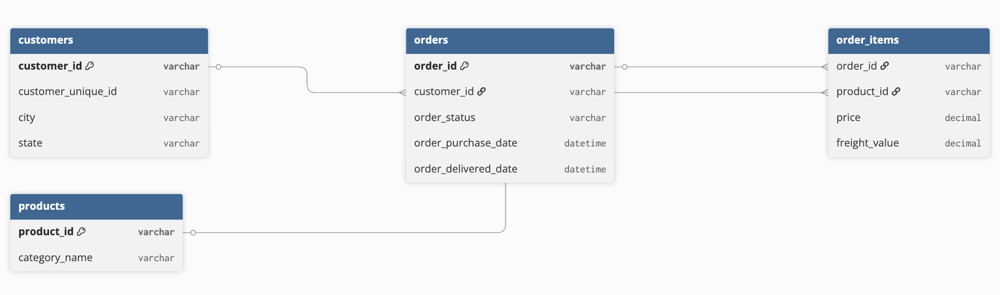

# 🛒 E-Commerce Sales Analysis (SQL)

## Overview
Analysis of 100,000+ orders from a Brazilian e-commerce platform 
using MySQL. Covers revenue trends, customer behavior, delivery 
performance, and product insights.

## Dataset
Brazilian E-Commerce Public Dataset by Olist (Kaggle)
- 96,462 orders | 32,949 products | 99,441 customers

## Schema

## Key Insights
- 📈 Peak revenue month: November 2017
- 🏆 Top category: Health & Beauty (beleza_saude)
- 🚚 Avg delivery time: 12.5 days
- 🔄 Repeat customer rate: 3.1%

## Queries Covered
1. Monthly Revenue Trend
2. Top 10 Categories by Revenue
3. Customer Lifetime Value
4. Delivery Time by State
5. Revenue vs Freight Analysis
6. Order Status Breakdown
7. Week-over-Week Growth
8. Top States by Revenue
9. Repeat vs One-Time Customers
10. Best Sales Day of Week

## Tools Used
MySQL 9.6.0 | MySQL Workbench
